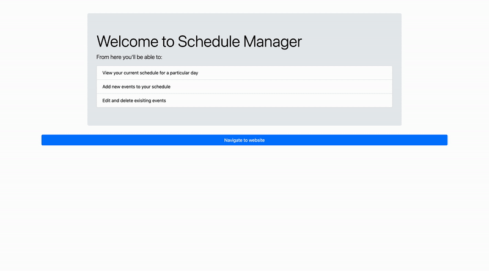

# Schedule Manager

Schedule Manager is a web application that allows users to manage their schedules by adding, editing, and deleting events. It provides a user-friendly interface for viewing events on different days of the week and allows users to toggle between light and dark mode for better readability.

## Features

- **View Schedule**: Users can view their schedule for each day of the week and see details of each event, including the event name, time, location, phone number, and extra information.
- **Add Event**: Users can add new events to their schedule by providing the event name, day of the week, start and end times, phone number, location, and extra information.
- **Edit Event**: Users can edit existing events in their schedule to update the event details.
- **Delete Event**: Users can delete events from their schedule if they no longer need them.
- **Dark/Light Mode**: Users can toggle between dark and light mode to customize their viewing experience.

## Technologies Used

- **Frontend**: HTML, CSS, JavaScript, Bootstrap
- **Backend**: Node.js, Express.js
- **Database**: MySQL
- **Session Management**: Express Session
- **Password Hashing**: Bcrypt

## Installation

1. Clone the repository: `git clone` <https://github.com/your-username/schedule-manager.git>
2. Install dependencies: `npm install`
3. Set up MySQL database and update the connection details in index.js
4. Start the server: `node index.js`
5. Access the application at <http://localhost:9003>

## Usage

1. Home Page: The home page displays a list of navigation links for Home, Schedule, Add Event, and Logout.
2. Schedule Page: Click on a day of the week to view the events scheduled for that day.
3. Add Event Page: Click on the Add Event link to add a new event to your schedule. Fill in the required details and submit the form.
4. Edit Event: To edit an existing event, click on the Edit button next to the event. Update the event details and submit the form.
5. Delete Event: To delete an event, click on the Delete button next to the event.
6. Toggle Dark/Light Mode: Use the toggle switch at the top of the page to switch between dark and light mode.

## Database Setup

**READ CAREFULLY**

To set up the database for the Schedule Manager application, follow these steps:

1. **Check SQL Files**: Check the files in the 'sql_js' directory of the project to set up the database. There should be SQL files for creating tables and inserting initial data.
2. **Create Database**: If you're using your own database, create a new database for the application.
3. **Update Connection Details**: In the 'index.js' file, update the MySQL connection details to match your database configuration.
4. **Verify Information**: Verify that all information in the 'index.js' file is correct, including the *secret key for sessions*, database host, user, password, and database name.
5. **Run Application**: Start the server by running node 'index.js' in the terminal. Access the application at <http://localhost:9003>.
6. **Set Up Tables**: If you're using the provided SQL files, run them in your MySQL database to create the necessary tables.
7. **Verify Data**: Verify that the tables have been created successfully and contain the necessary data.
8. **Test Application**: Test the application to ensure that it is running correctly and that you can add, edit, and delete events.

## Contributing

Contributions are welcome! Please fork the repository and submit a pull request with your changes.

Acknowledgements

- Bootstrap for the responsive design components
- MySQL for the database management
- Express.js for the backend framework
